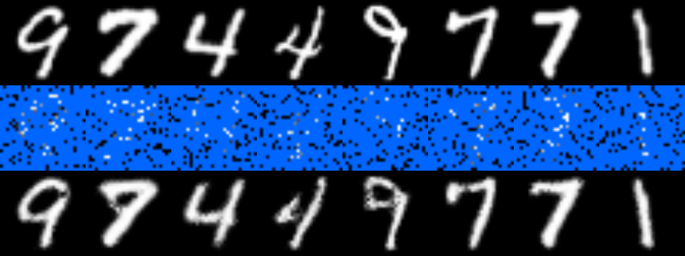
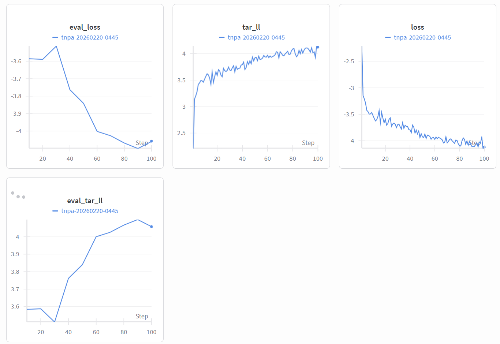

# Transformer Neural Processes: Uncertainty-Aware Meta Learning Via Sequence Modeling

This is the implementation of the paper [Transformer Neural Processes: Uncertainty-Aware Meta Learning Via Sequence Modeling](https://arxiv.org/abs/2207.04179) in Pytorch.


## Install

First, clone the repository:

```
git clone https://github.com/tung-nd/TNP-pytorch.git
```

Then install the dependencies:

```bash
conda create -n tnp python==3.10
conda activate tnp
pip install -r requirements.txt
wandb login
```

## Project Structure

```
tnp/
├── regression/          # 1D GP, CelebA, EMNIST regression tasks
├── bayesian_optimization/  # 1D and high-dim Bayesian optimization
├── contextual_bandits/  # Contextual multi-armed bandits (Wheel)
├── scripts/
│   ├── train/           # Training shell scripts
│   └── eval/            # Evaluation shell scripts
├── results/             # Saved model checkpoints and logs
├── evalsets/            # Generated evaluation datasets
└── datasets/            # Raw/processed datasets
```

## Supported Models

| Model | Key |
|---|---|
| Conditional Neural Process | `cnp` |
| Conditional Attentive Neural Process | `canp` |
| Neural Process | `np` |
| Attentive Neural Process | `anp` |
| Bootstrapping Neural Process | `bnp` |
| Bootstrapping Attentive Neural Process | `banp` |
| Transformer Neural Process (Autoregressive) | `tnpd` |
| Transformer Neural Process (Diagonal) | `tnpa` |
| Transformer Neural Process (Non-Diagonal) | `tnpnd` |

## Usage

We provide modular shell scripts for training and evaluation in the `scripts/` directory. Each script has configurable variables at the top and accepts additional arguments via `"$@"`.

For detailed instructions on each task, please refer to the specific READMEs:
- [Regression Tasks](regression/README.md) — GP, CelebA, EMNIST
- [Bayesian Optimization](bayesian_optimization/README.md) — 1D and high-dim BO
- [Contextual Bandits](contextual_bandits/README.md) — Wheel bandit

### Training

```bash
# GP Regression (also used as 1D BO surrogate)
./scripts/train/train_gp.sh

# CelebA Image Completion
./scripts/train/train_celeba.sh

# EMNIST Image Completion
./scripts/train/train_emnist.sh

# Contextual Bandits
./scripts/train/train_cmab.sh

# High-Dim Bayesian Optimization (GP surrogate training)
./scripts/train/train_bo_gp_highdim.sh
```

### Evaluation

Evaluation scripts run `eval_all_metrics` mode (accuracy, calibration, sharpness, scoring rules) followed by `plot` mode to save figures automatically.

If `--expid` is not specified, the scripts **automatically use the latest experiment** found in the results directory.

```bash
# GP Regression — eval_all_metrics + plot
./scripts/eval/eval_gp.sh

# CelebA — eval_all_metrics + plot
./scripts/eval/eval_celeba.sh

# EMNIST — eval_all_metrics + plot
./scripts/eval/eval_emnist.sh

# Contextual Bandits
./scripts/eval/eval_cmab.sh

# 1D BO Loop
./scripts/eval/run_bo_1d.sh

# High-Dim BO Loop
./scripts/eval/run_bo_highdim.sh
```

To evaluate a specific experiment:
```bash
./scripts/eval/eval_gp.sh --expid 20260212-2030
```


### Resuming Training

If training was interrupted, resume from the last checkpoint using `--resume`:

```bash
./scripts/train/train_gp.sh --expid 20260212-2030 --resume 20260212-2030
```

The `--resume` flag loads the saved model weights, optimizer state, scheduler state, and step counter from `results/{task}/{model}/{expid}/ckpt.tar`.

### Weights & Biases Integration

W&B is initialized automatically during training. Configure via:

| Argument | Description | Default |
|---|---|---|
| `--wandb-project` | W&B project name | task-specific |
| `--wandb-entity` | W&B team/user | `None` |

Run `wandb login` before first use.



## Acknowledgement

The implementation of the baselines is borrowed from the official code base of [Transformer Neural Processes: Uncertainty-Aware Meta Learning Via Sequence Modeling](https://github.com/tung-nd/TNP-pytorch).